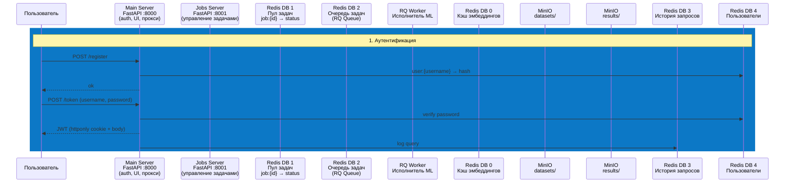

# ML-система кластеризации

* Система доступна на http://108.165.32.182/ui

## Порядок действия для запуска системы

* Создание базового образа
```
docker build -t base_server:latest -f base_server/Dockerfile .
```
* Запуск
```
docker-compose down --remove-orphans && docker-compose -f docker-compose-production.yml up --build
```
* При первом запуске перейдите по `http://127.0.0.1:9001` и создайте в хранилище два бакета: `datasets` и `results`.

## Демонстрация работы


## Архитектура приложения


1. Problem Statement (2 min)
- Medical/scientific text documents (PubMed abstracts) need to be grouped by topic
- No-code solution needed for non-technical researchers/doctors
- Manual clustering is slow, inconsistent, and doesn't scale
2. What It Does — Demo (3 min)
- Upload CSV → pick algorithm + embedding → get results + visualization
- Show the demo GIF (docs/record.gif)
- Show output: CSV download + cluster PNG with quality metrics
3. Architecture Overview (4 min)
Browser → [Caddy] → main_server → jobs_server → rq-worker
                         ↕                ↕
                      Redis ←──────┬──→ MinIO (S3)
- Two FastAPI servers: user-facing (auth, upload, results) vs internal (job lifecycle)
- Redis: 5 logical databases (embeddings cache, job pool, queue, query history, users)
- MinIO: dataset storage + clustering results
- Async job processing via RQ worker
4. ML Pipeline (4 min)
- Preprocessing: NLTK tokenization, lemmatization, stop-word removal
- Embeddings: TF-IDF, Word2Vec, Doc2Vec (cached in Redis to avoid recomputation)
- Clustering: K-Means or Spectral Clustering with tunable hyperparams
- Theme labeling: LDA generates human-readable cluster names (e.g. cancer_treatment_patient)
- Quality metrics: Davies-Bouldin, Calinski-Harabasz, Dunn Index, Silhouette Score
5. Key Features (3 min)
- JWT auth with cookie + Bearer token, admin role
- Web UI for full workflow + 2 admin panels (users, query history)
- Pre-signed S3 download URLs (10 min expiry)
- Production-ready: Docker Compose, Caddy reverse proxy, healthchecks
6. Tech Stack & Scale (2 min)
- ~1,800 lines Python, ~2,260 lines HTML/CSS/JS, 6 Docker services
- Python 3.11, FastAPI, scikit-learn, Gensim, NLTK, Redis, MinIO, RQ, Matplotlib
7. Results & Demo Output (2 min)
- Show a sample clustering result PNG (histogram + 4 quality cards)
- Show a sample theme output like cancer_treatment_patient

TODO: КАК НА WEB-UI уровне сохранять историю запусков кластеризаций? (запустить сразу много, потом кликать по списку и смотреть результаты)
