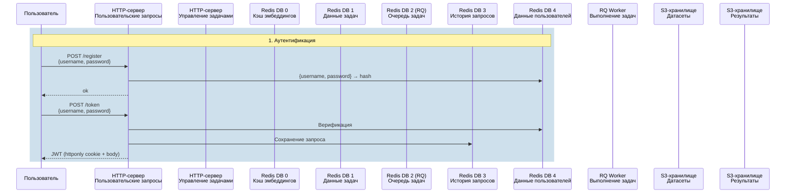
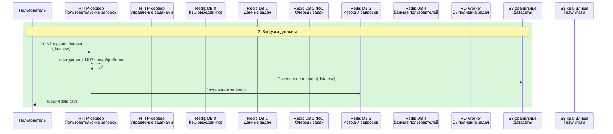
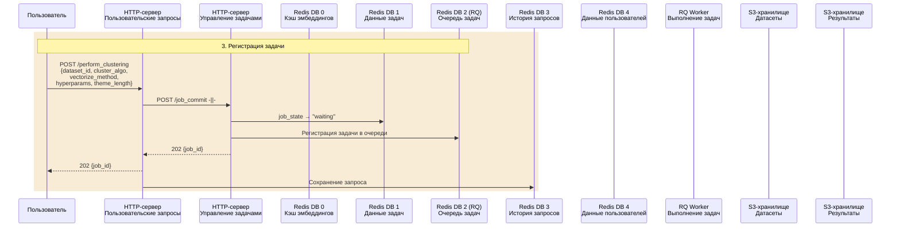
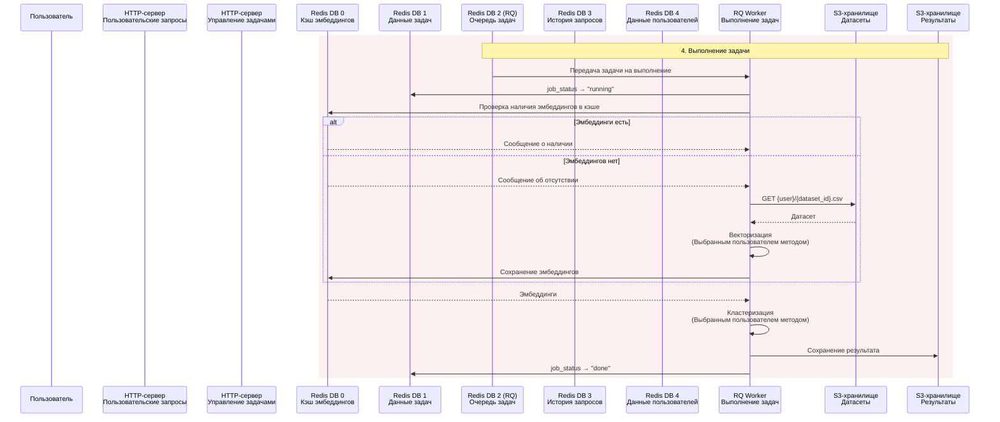
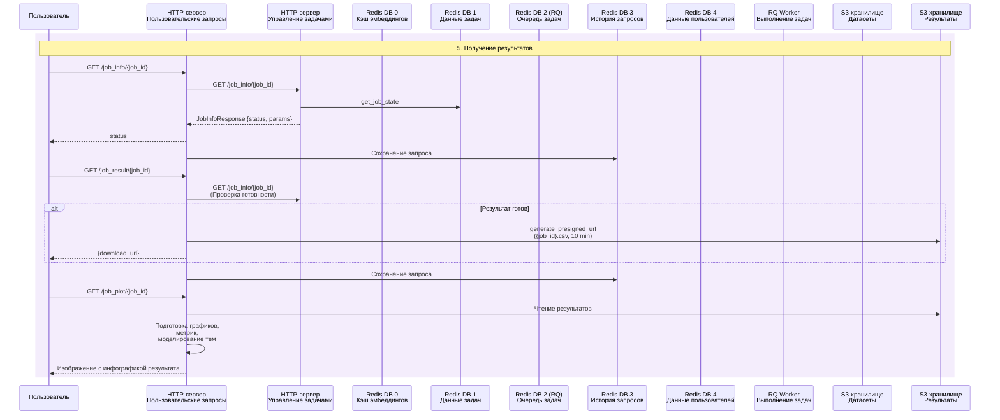

# Архитектура сервиса

```mermaid
sequenceDiagram
    participant User as Пользователь
    participant MainServer as HTTP-сервер <br/> Пользовательские запросы
    participant JobsServer as HTTP-сервер <br/> Управление задачами
    participant RedisDB0 as Redis DB 0 <br/> Кэш эмбеддингов
    participant RedisDB1 as Redis DB 1 <br/> Данные задач
    participant RedisDB2 as Redis DB 2 (RQ) <br/> Очередь задач
    participant RedisDB3 as Redis DB 3 <br/> История запросов
    participant RedisDB4 as Redis DB 4 <br/> Данные пользователей
    participant Worker as RQ Worker <br/> Выполнение задач
    participant MinioDatasets as S3-хранилище <br/> Датасеты
    participant MinioResults as S3-хранилище <br/> Результаты
    rect rgb(206, 224, 236)
        Note over User,RedisDB4: 1. Аутентификация
        User->>MainServer: POST /register <br/> {username, password}
        MainServer->>RedisDB4: {username, password} → hash
        MainServer-->>User: ok
        User->>MainServer: POST /token <br/> {username, password}
        MainServer->>RedisDB4: Верификация
        MainServer->>RedisDB3: Сохранение запроса
        MainServer-->>User: JWT (httponly cookie + body)
    end
```

```mermaid
sequenceDiagram
    participant User as Пользователь
    participant MainServer as HTTP-сервер <br/> Пользовательские запросы
    participant JobsServer as HTTP-сервер <br/> Управление задачами
    participant RedisDB0 as Redis DB 0 <br/> Кэш эмбеддингов
    participant RedisDB1 as Redis DB 1 <br/> Данные задач
    participant RedisDB2 as Redis DB 2 (RQ) <br/> Очередь задач
    participant RedisDB3 as Redis DB 3 <br/> История запросов
    participant RedisDB4 as Redis DB 4 <br/> Данные пользователей
    participant Worker as RQ Worker <br/> Выполнение задач
    participant MinioDatasets as S3-хранилище <br/> Датасеты
    participant MinioResults as S3-хранилище <br/> Результаты
    rect rgb(218, 246, 218)
        Note over User,MinioDatasets: 2. Загрузка датасета
        User->>MainServer: POST /upload_dataset <br/> {data.csv}
        MainServer->>MainServer: валидация + NLP-предобработка
        MainServer->>MinioDatasets: Сохранение в {user}/{data.csv}
        MainServer->>RedisDB3: Сохранение запроса
        MainServer-->>User: {user}/{data.csv}
    end
```

```mermaid
sequenceDiagram
    participant User as Пользователь
    participant MainServer as HTTP-сервер <br/> Пользовательские запросы
    participant JobsServer as HTTP-сервер <br/> Управление задачами
    participant RedisDB0 as Redis DB 0 <br/> Кэш эмбеддингов
    participant RedisDB1 as Redis DB 1 <br/> Данные задач
    participant RedisDB2 as Redis DB 2 (RQ) <br/> Очередь задач
    participant RedisDB3 as Redis DB 3 <br/> История запросов
    participant RedisDB4 as Redis DB 4 <br/> Данные пользователей
    participant Worker as RQ Worker <br/> Выполнение задач
    participant MinioDatasets as S3-хранилище <br/> Датасеты
    participant MinioResults as S3-хранилище <br/> Результаты
    rect rgb(249, 236, 215)
        Note over User,RedisDB2: 3. Регистрация задачи
        User->>MainServer: POST /perform_clustering <br/> {dataset_id, cluster_algo, <br/> vectorize_method, <br/> hyperparams, theme_length}
        MainServer->>JobsServer: POST /job_commit -||- 
        JobsServer->>RedisDB1: job_state → "waiting"
        JobsServer->>RedisDB2: Регистрация задачи в очереди
        JobsServer-->>MainServer: 202 {job_id}
        MainServer-->>User: 202 {job_id}
        MainServer->>RedisDB3: Сохранение запроса
    end
```

```mermaid
sequenceDiagram
    participant User as Пользователь
    participant MainServer as HTTP-сервер <br/> Пользовательские запросы
    participant JobsServer as HTTP-сервер <br/> Управление задачами
    participant RedisDB0 as Redis DB 0 <br/> Кэш эмбеддингов
    participant RedisDB1 as Redis DB 1 <br/> Данные задач
    participant RedisDB2 as Redis DB 2 (RQ) <br/> Очередь задач
    participant RedisDB3 as Redis DB 3 <br/> История запросов
    participant RedisDB4 as Redis DB 4 <br/> Данные пользователей
    participant Worker as RQ Worker <br/> Выполнение задач
    participant MinioDatasets as S3-хранилище <br/> Датасеты
    participant MinioResults as S3-хранилище <br/> Результаты

    rect rgb(252, 240, 240)
        Note over RedisDB2,MinioResults: 4. Выполнение задачи
        RedisDB2->>Worker: Передача задачи на выполнение
        Worker->>RedisDB1: job_status → "running"
        Worker->>RedisDB0: Проверка наличия эмбеддингов в кэше
        alt Эмбеддинги есть
            RedisDB0-->>Worker: Сообщение о наличии
        else Эмбеддингов нет
            RedisDB0-->>Worker: Сообщение об отсутствии
            Worker->>MinioDatasets: GET {user}/{dataset_id}.csv
            MinioDatasets-->>Worker: Датасет
            Worker->>Worker: Векторизация <br/> (Выбранным пользователем методом)
            Worker->>RedisDB0: Сохранение эмбеддингов
        end
        RedisDB0-->>Worker: Эмбеддинги
        Worker->>Worker: Кластеризация <br/> (Выбранным пользователем методом)
        Worker->>MinioResults: Сохранение результата
        Worker->>RedisDB1: job_status → "done"
    end
```

```mermaid
sequenceDiagram
    participant User as Пользователь
    participant MainServer as HTTP-сервер <br/> Пользовательские запросы
    participant JobsServer as HTTP-сервер <br/> Управление задачами
    participant RedisDB0 as Redis DB 0 <br/> Кэш эмбеддингов
    participant RedisDB1 as Redis DB 1 <br/> Данные задач
    participant RedisDB2 as Redis DB 2 (RQ) <br/> Очередь задач
    participant RedisDB3 as Redis DB 3 <br/> История запросов
    participant RedisDB4 as Redis DB 4 <br/> Данные пользователей
    participant Worker as RQ Worker <br/> Выполнение задач
    participant MinioDatasets as S3-хранилище <br/> Датасеты
    participant MinioResults as S3-хранилище <br/> Результаты
    rect rgb(244, 237, 252)
        Note over User,MinioResults: 5. Получение результатов
        User->>MainServer: GET /job_info/{job_id}
        MainServer->>JobsServer: GET /job_info/{job_id}
        JobsServer->>RedisDB1: get_job_state
        JobsServer-->>MainServer: JobInfoResponse {status, params}
        MainServer-->>User: status
        MainServer->>RedisDB3: Сохранение запроса

        User->>MainServer: GET /job_result/{job_id}
        MainServer->>JobsServer: GET /job_info/{job_id} <br/> (Проверка готовности)
        alt Результат готов
            MainServer->>MinioResults: generate_presigned_url <br/> ({job_id}.csv, 10 min)
            MainServer-->>User: {download_url}
        end
        MainServer->>RedisDB3: Сохранение запроса

        User->>MainServer: GET /job_plot/{job_id}
        MainServer->>MinioResults: Чтение результатов
        MainServer->>MainServer: Подготовка графиков, <br/> метрик, <br/> моделирование тем
        MainServer-->>User: Изображение с инфографикой результата
    end

```
